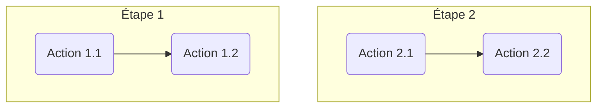

# Description
---

By default the theme manages the [Mermaid](https://mermaid-js.github.io/mermaid/#/) format, allowing to display diagrams created from text and code, while adding several utility functionalities.

The several characteristics and functionalities of the Mermaid management in the theme are:
* rendered from a fenced code block and `mermaid` highlight language
* export button associated to each rendered svg
* preview (click on the rendered image)

# Examples
---

| Markdown | Rendering |
| -------- | --------- |
|
`````````

`````````
|

|