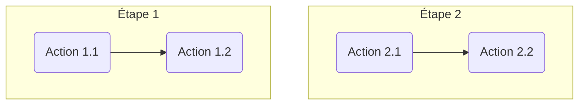

# Description
---

Par défaut le thème prend en charge le format [Mermaid](https://mermaid-js.github.io/mermaid/#/), permettant d'afficher des diagrammes créés à partir de texte et de code, et en rajoutant diverses fonctionnalités utilitaires.

Les différentes caractéristiques et fonctionnalités du thème liées à Mermaid sont :
* rendu obtenu à partir d'un bloc de code cloisonné et language de surlignage à `mermaid`
* bouton d'export associé a chaque svg généré
* aperçu (clic sur l'image généré)

# Exemples
---

| Markdown | Rendu |
| -------- | ----- |
|
`````````

`````````
|

|
